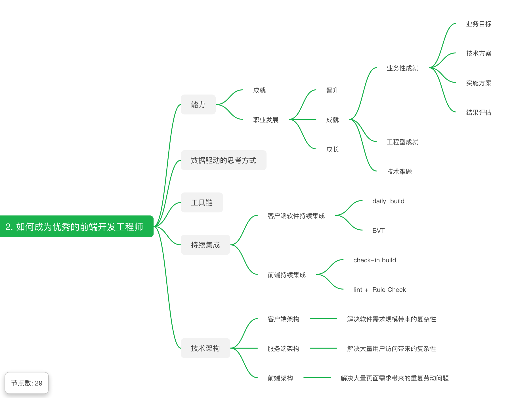

# 每周总结可以写在这里

## 重学|构建知识体系
## 前端技能
* 编程能力：
    * 解决难题问题的能力
    * 练习：刷题
* 架构能力：
    * 将小的问题整合起来，以解决大的问题
    * 练习：读源码，参与开源项目
* 工程能力；
    * 解决的是人的问题
* 前端知识
* 领域知识

## 学习方法：
* 整理法
    * 顺序关系
    * 组合关系
    * 维度关系
    * 分类关系
* 追溯法
    * https://developer.mozilla.org/en-US/docs/Web
    * https://whatwg.org/
    * https://www.w3.org/TR/?tag=css&status=wd

## 重学|工程体系
