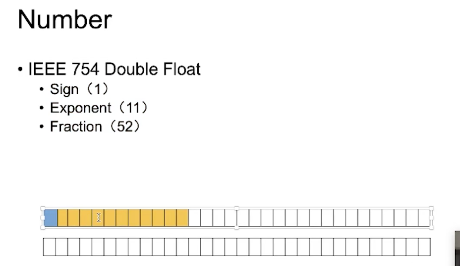

[TOC]

## 前言
* Atom
* Express
* statement
* structure
* Program/Module

## Unicode
> 中文：万国码、国际码、统一码、单一码。是计算机科学领域里的一项业界标准。它对世界上大部分的文字系统进行了整理、编码，使得电脑可以用更为简单的方式来呈现和处理文字。
* https://home.unicode.org/
* https://www.fileformat.info/info/unicode/

```
U+0010	DATA LINK ESCAPE (U+0010)
U+0020	SPACE (U+0020)
```

##### 知识拓展
* String.fromCharCode
* String.charAt charAt() 方法从一个字符串中返回指定的字符。

* String.fromCodePoint
* String.charCodeAt charCodeAt() 方法返回0到65535之间的整数

## lexical grammar

// 词法分析
* InputElement
    * WhiteSpace 
        * `<TAB>`
        * `<VT>`
        * `<FF>`
        * `<SP> `
        * `<NBSP>` （no-break-space）
        * `<ZWNBSP>` 
        * `<USP>`
        * https://www.fileformat.info/info/unicode/category/Zs/list.htm
    * LineTerminator (换行符)
        * `<LF>`
        * `<CR>`
        * `<LS>`
        * `<PS>`
    * Comment（* 不可用\u002a替代）
        * MultiLineComment
        * SingleLineComment
    * Token （令牌，词）
        * keywords
        * Punctuator (符号)
        * Literal （直接量）
        * IdentifierName
            * Identifier
                * 变量名
                * 属性名
            * Keywords
            * Futer reserved keywords：enum

## Literal
### number


* DecimalLiteral
    * 0
    * 12.3e10
    * .3
* BinaryIntegerLiteral
    * 0b001
* OctalIntegerLitreal
    * 0o11
* HexIntegerLiteral
    * 0xFF

##### 最佳实践
* safe Integer
    * `Number.MAX_SAFE_INTEGER.toString(16)
"1fffffffffffff"` —— 1fffffffffffff
    * Float Compare
        * Number.EPSILON 属性表示1 与Number可表示的大于1 的最小的浮点数之间的差值。

###### 拓展知识
> Float64Array 类型数组代表的是平台字节顺序为64位的浮点数型数组(对应于 C 浮点数据类型) 。

> Uint8Array 数组类型表示一个8位无符号整型数组，创建时内容被初始化为0。创建完后，可以以对象的方式或使用数组下标索引的方式引用数组中的元素。
        
### String
* character
* code point
* Encoding

##### string grammar
* 单、双引号
    * \转义
    * \n \r  \f ...
* 字符串模板

