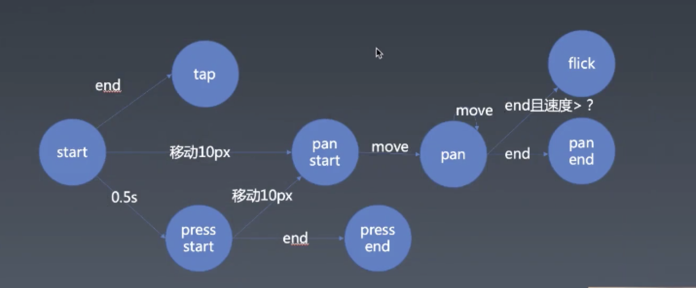

# 每周总结可以写在这里

## 手势
* tap ： 触点
* pan ： 较慢拖动
* Flick： 快速拖动并离开
* press： 按压

## 关于系统手势
系统手势可以关掉 多指操作，多指操作一般是两指。两指操作一般会形成tansform,而且是有且仅有translate,rotate,scale。  
爽直手势，将三个手势有机组合在一起，变成matrix transform(矩阵)

## 事件派发
customEvent （mdn）

## matrix
css动画不会用来做一个很复杂的动画，不好控制。  
matrix比较难解回来；  
translate、rotate、scale、 skew  
用矩阵来描述transform  
线性代数 矩阵  